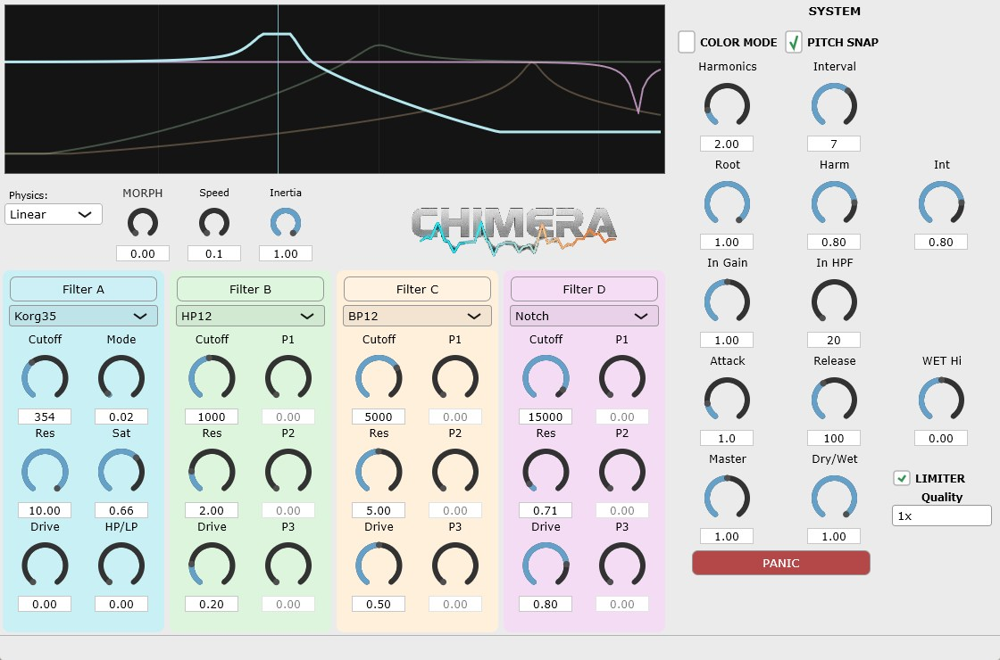

<div align="center">
  
  <p><i>A filter for perverts, by perverts, for perverts</i></p>
</div



## ⚠️ 重要な安全上の警告

**本プラグインを使用する前に、必ずお読みください。**

CHIMERA Filterは高いレゾナンス設定や特定のフィルタータイプを使用した際に、**非常に大きな音量のフィードバック**や**自己発振**を発生させる可能性があります。

**耳とスピーカーを保護するために：**

- 使用開始時は必ず**マスターボリュームを低く設定**してください
- **ヘッドフォン使用時は特に注意**してください。聴覚に永続的なダメージを与える可能性があります
- 高いResonance値（特に5.0以上）を使用する際は、事前にボリュームを下げてください
- Color Modeを有効にする前に、必ずボリュームを確認してください
- 問題が発生した場合は、**PANICボタン**を押して緊急リセットしてください

**免責事項：** 本プラグインの使用により生じた聴覚障害、機材の損傷、その他いかなる損害についても、開発者は一切の責任を負いません。ユーザー自身の責任において、適切な音量管理を行ってください。

---
### 📥 Download

最新のビルド済みプラグイン（VST3）は、以下の **Releases** ページからダウンロードしてください。

👉 **[Download FDN Reverb v1.0.0 (GitHub Releases)](https://github.com/OTODESK4193/FDN-Reverb/releases/tag/v1.0.0)**


---

## 目次

1. [概要](#概要)
2. [インターフェース解説](#インターフェース解説)
3. [フィルタータイプ一覧（全21種類）](#フィルタータイプ一覧全21種類)
4. [Physicsモード（モーフィング物理エンジン）](#physicsモードモーフィング物理エンジン)
5. [Color Mode（ポリフォニックシンセモード）](#color-modeポリフォニックシンセモード)
6. [パラメータリファレンス](#パラメータリファレンス)
7. [使い方のヒント](#使い方のヒント)
8. [搭載技術について](#搭載技術について)
9. [トラブルシューティング](#トラブルシューティング)

---

## 概要

CHIMERA Filterは、4つの独立したフィルターヘッド（Filter A、B、C、D）を搭載した革新的なモーフィングフィルタープラグインです。各フィルターは21種類のフィルタータイプから選択でき、MORPHノブで4つのフィルター間をシームレスに移行できます。

**主な特徴：**

- **4ヘッド・モーフィング・アーキテクチャ**: 4つのフィルターを滑らかにクロスフェード
- **21種類のフィルタータイプ**: クラシックなSVFからMoog、TB-303風まで網羅
- **6種類のPhysicsモード**: モーフィングに物理シミュレーションを適用
- **Color Mode**: フィルターの自己発振を利用したポリフォニック楽音生成
- **オーバーサンプリング**: 1x/2x/4xの品質設定
- **内蔵リミッター**: 出力保護機能

---

## インターフェース解説

### 上部エリア（グラフィックディスプレイ）

周波数特性のリアルタイム表示。4つのフィルターの特性曲線が色分けされて表示されます。

- **水色（Filter A）**: 左端
- **緑色（Filter B）**: 左中央
- **オレンジ（Filter C）**: 右中央  
- **紫色（Filter D）**: 右端

### 左エリア（Physics / MORPH）

- **Physics**: モーフィングの動作アルゴリズムを選択
- **MORPH**: 4つのフィルター間の位置（0.0～1.0）
- **Speed / Param A**: 各Physicsモードの主要パラメータ
- **Inertia / Param B**: 各Physicsモードの副次パラメータ

### 中央エリア（Filter A～D）

4つの独立したフィルターセクション。それぞれに以下のコントロールがあります：

- **タイプ選択**: 21種類のフィルターから選択
- **Cutoff**: カットオフ周波数（20Hz～20,000Hz）
- **Res**: レゾナンス（0.1～10.0）
- **Drive**: サチュレーション/歪み
- **P1/P2/P3**: フィルター固有のパラメータ

### 右エリア（SYSTEM）

- **COLOR MODE**: ポリフォニックシンセモード
- **PITCH SNAP**: カットオフを半音単位にスナップ
- **Harmonics / Interval**: Color Mode用の倍音設定
- **Root / Harm / Int**: 各ボイスの音量
- **In Gain / In HPF**: 入力ゲインとハイパスフィルター
- **Attack / Release**: WETエンベロープ
- **WET Hi**: 高域シェルフ
- **Master / Dry/Wet**: 出力コントロール
- **LIMITER**: 出力保護リミッター
- **Quality**: オーバーサンプリング設定
- **PANIC**: 緊急リセットボタン

---

## フィルタータイプ一覧（全21種類）

### 基本SVFフィルター（0～3）

#### LP12 (LowPass)
**12dB/octローパスフィルター**

Cutoff周波数より上の高域をカットします。温かく丸みのあるサウンドを作成するのに最適です。

- **用途**: ベースの太さを出す、高域のハーシュさを抑える
- **P1/P2/P3**: 使用しません

#### HP12 (HighPass)
**12dB/octハイパスフィルター**

Cutoff周波数より下の低域をカットします。軽やかでエアリーなサウンドを作成します。

- **用途**: 低域のモゴモゴ感を除去、パッドの浮遊感
- **P1/P2/P3**: 使用しません

#### BP12 (BandPass)
**12dB/octバンドパスフィルター**

Cutoff周波数周辺のみを通過させます。電話のような効果やボーカルの強調に使えます。

- **用途**: ラジオボイス効果、特定帯域の強調
- **P1/P2/P3**: 使用しません

#### Notch
**ノッチ（バンドリジェクト）フィルター**

Cutoff周波数をピンポイントでカットします。特定の周波数の問題を除去するのに使用します。

- **用途**: フィードバック除去、フェイザー的効果の基礎
- **P1/P2/P3**: 使用しません

---

### アナログモデリングフィルター（4～7）

#### Moog Ladder
**Moogスタイル24dB/octラダーフィルター**

伝説的なMoogシンセサイザーのフィルターをモデリング。太く温かいアナログサウンドの代名詞です。

- **Character (P1)**: フィルターの性格（明るい〜暗い）
- **Comp (P2)**: 高レゾナンス時の音量補正
- **Drift (P3)**: アナログ風の微妙な揺らぎを追加

**ヒント**: Resを7以上にすると自己発振が始まります。Color Modeで楽音として使用可能です。

#### Peak
**パラメトリックEQピーキングフィルター**

特定の周波数帯域をブーストするEQです。

- **Gain (P1)**: ブースト量（0～24dB）
- **BW (P2)**: 帯域幅（狭い〜広い）
- **P3**: 使用しません

**用途**: 特定帯域の強調、プレゼンス追加

#### Comb
**コムフィルター**

短いディレイによるくし形周波数特性を生成。金属的・ベル的なサウンドを作成します。

- **Time (P1)**: ディレイ時間（ピッチに直接影響）
- **FB (P2)**: フィードバック量（金属感の強さ）
- **Polar (P3)**: 極性切替（+/-で音色変化）

**ヒント**: Timeを調整してピッチを変え、FBを上げると金属的な響きが強まります。

#### Oberheim SEM
**Oberheim SEM風ステートバリアブルフィルター**

滑らかで上品なアナログサウンド。LP/Notch/HPをシームレスにモーフィングできます。

- **Mode (P1)**: LP〜Notch〜HPの連続変化
- **Warm (P2)**: 温かみ（ソフトサチュレーション）
- **P3**: 使用しません

---

### モジュレーション系フィルター（8～10）

#### Flanger
**フランジャー効果**

ジェット機のような「シュー」というスウィープ効果を生成します。

- **Rate (P1)**: LFO速度（うねりの速さ）
- **Depth (P2)**: 変調深さ（効果の強さ）
- **FB (P3)**: フィードバック（ジェット感）

#### Diffuser
**ディフューザー（空間拡散）**

リバーブの初期反射に近い効果。空間的な広がりを追加します。

- **Diff (P1)**: 拡散量（ぼかし具合）
- **Stage (P2)**: オールパス段数（2～8段）
- **Mod (P3)**: LFO変調（動きを追加）

#### Steiner-Parker
**Steiner-Parkerスタイルフィルター**

アグレッシブで荒々しいキャラクターの12dBフィルター。

- **Mode (P1)**: LP〜BP〜HPの連続変化
- **Aggr (P2)**: アグレッシブさ（歪み量）
- **P3**: 使用しません

---

### ヴィンテージシンセモデリング（11～16）

#### Diode Ladder
**TB-303風ダイオードラダーフィルター**

アシッドハウスで有名なTB-303のスクウィーキーなサウンドを再現。

- **Sat (P1)**: ダイオードサチュレーション
- **Asym (P2)**: 非対称歪み（偶数倍音を追加）
- **FB (P3)**: フィードバック特性

**ヒント**: Resを上げてCutoffを動かすと、アシッドベースラインの典型的なサウンドが得られます。

#### Formant
**フォルマントフィルター**

人間の声を模倣したフィルター。母音のような響きを生成します。

- **Vowel (P1)**: 母音選択（A-E-I-O-U）
- **Gender (P2)**: 声質（男性〜女性）
- **Sharp (P3)**: フォルマントの鋭さ

#### Phaser
**フェイザー**

複数のオールパスフィルターによる位相シフト効果。うねり感のあるサウンドを作成します。

- **Rate (P1)**: LFO速度
- **Depth (P2)**: 変調深さ
- **FB (P3)**: フィードバック（深みを追加）

#### Wasp
**EDP Wasp風フィルター**

CMOSチップによる独特の荒々しいキャラクターを再現。

- **Mode (P1)**: LP〜HPモーフィング
- **Grit (P2)**: CMOS風の荒さ
- **P3**: 使用しません

#### Korg35
**MS-20風Korg35フィルター**

Korg MS-20の鋭い自己発振が特徴のフィルター。

- **Mode (P1)**: LP / HP 切替
- **Sat (P2)**: サチュレーション量
- **HP/LP (P3)**: HPFミックス量

**ヒント**: 高いResで独特のスクリーミングな自己発振が得られます。

#### LPG (Lowpass Gate)
**Buchla風ローパスゲート**

VCA（アンプ）とVCF（フィルター）を組み合わせた西海岸シンセの特徴的なサウンド。

- **Gate (P1)**: VCA/LPF/両方の切替
- **Resp (P2)**: Vactrol応答速度
- **Color (P3)**: フィルター色付け

**特徴**: Vactrolセルの自然な応答による有機的なエンベロープ。

---

### エフェクト系フィルター（17～20）

#### Resonator
**レゾネーター（弦共鳴シミュレーション）**

Karplus-Strongアルゴリズムによる弦の共鳴をシミュレート。

- **Decay (P1)**: 減衰時間（残響の長さ）
- **Bright (P2)**: 明るさ（高域成分）
- **Mix (P3)**: Dry/Wetバランス

**用途**: 弦楽器的な響きの追加、ピチカート効果

#### RingMod
**リングモジュレーター**

入力信号とキャリア波を乗算。ベルやメタリックなサウンドを生成します。

- **Freq (P1)**: キャリア周波数
- **Mix (P2)**: Dry/Wetバランス
- **Rect (P3)**: 整流量（0=バイポーラ、1=フル整流）

#### Bitcrusher
**ビットクラッシャー**

ビット深度とサンプルレートを下げてローファイ効果を作成。

- **Bits (P1)**: ビット深度（1～16ビット）
- **Down (P2)**: ダウンサンプル率（1x～50x）
- **Mix (P3)**: Dry/Wetバランス

**ヒント**: 8ビット風レトロゲームサウンドや、エクストリームなデジタル歪みに。

#### VocalFilter
**ボーカルフィルター（5フォルマント）**

5つのフォルマント周波数を使用した高度なボーカルシミュレーション。

- **Vowel (P1)**: 母音モーフィング（A-E-I-O-U）
- **Char (P2)**: キャラクター（男性〜女性）
- **Sharp (P3)**: フォルマントの鋭さ

---

## Physicsモード（モーフィング物理エンジン）

MORPHノブの動きに物理シミュレーションを適用する6種類のモードです。

### Linear（線形）
**等速移動＋慣性**

DJフィルター的な滑らかな動き。スムーズなクロスフェードに最適。

- **Speed (A)**: 移動速度
- **Inertia (B)**: 慣性（加減速の滑らかさ）

### Stepped（ステップ）
**階段状の変化**

値を離散的なステップに量子化。アルペジエーター的な効果が得られます。

- **Steps (A)**: ステップ数（2～24段）
- **Smooth (B)**: 角の丸み（ステップ間の遷移の滑らかさ）

### Elastic（弾性）
**バネ振動**

ターゲットを超えてバウンドするバネのような動き。オーバーシュートが特徴。

- **Tension (A)**: バネの強度
- **Damping (B)**: 摩擦/減衰

### Sloth（遅延）
**可変カーブ遅延**

ゆったりとした変化。最大4秒の遅延時間を設定可能。

- **Time (A)**: 遅延時間（最大4秒）
- **Curve (B)**: カーブ形状（0=線形、1=対数/S字）

**ヒント**: アンビエントや緩やかな変化に最適。

### Chaos（カオス）
**ローレンツアトラクタ**

予測不能な動きを生成。カオス理論に基づいたモジュレーション。

- **Speed (A)**: カオスの速度
- **Tether (B)**: ターゲットへの拘束力（0=自由、1=制約）

### Bounce（バウンス）
**重力＋バウンド**

ボールが跳ねるような動き。リズミカルな変化を作成。

- **Gravity (A)**: 重力の強さ
- **Bounciness (B)**: 反発係数（0=鈍い、1=弾む）

---

## Color Mode（ポリフォニックシンセモード）

### 概要

Color Modeは、フィルターの自己発振を利用してポリフォニックシンセサイザーとして使用するモードです。MIDI入力に応じてフィルターが楽音を生成します。

### Ableton Live 11での使用方法

1. **MIDIトラックの設定**
   - CHIMERA FilterをMIDIトラックに挿入
   - 「MIDI From」を「All Ins」または目的のMIDI入力に設定

2. **オーディオソースの設定**
   - Color Modeでは入力オーディオが励起源となります
   - ノイズ、パッド、または任意のサウンドを入力として使用
   - 入力がない場合、フィルターの自己発振のみで発音

3. **Color Modeの有効化**
   - 右側SYSTEMパネルの「COLOR MODE」をオン
   - 6ボイスポリフォニーで動作

4. **推奨設定**
   - **フィルタータイプ**: BandPass、Peak、Resonator、Formant、VocalFilter（推奨）
   - **Resonance**: 4.0以上で明確なピッチ感
   - **Attack/Release**: クリックを防ぐため、Attack 2ms以上、Release 5ms以上

5. **Harmonics設定**
   - **Harmonics**: 倍音の比率（1.0=基音のみ、2.0=オクターブ上）
   - **Interval**: 半音単位のインターバル（7=5度）
   - **Root/Harm/Int**: 各ボイスの音量バランス

### 重要な注意点

- **⚠️ 音量に注意**: Color Mode有効時、高いResonance設定は非常に大きな音を発生させます
- PANICボタンの位置を確認しておいてください
- LIMITERを有効にすることを強く推奨します

---

## パラメータリファレンス

### 入力セクション

| パラメータ | 範囲 | 説明 |
|-----------|------|------|
| In Gain | 0.0～2.0 | 入力ゲイン |
| In HPF | 20Hz～500Hz | 入力ハイパスフィルター |

### WETセクション

| パラメータ | 範囲 | 説明 |
|-----------|------|------|
| Attack | 0.1～100ms | WET信号のアタック時間 |
| Release | 10～1000ms | WET信号のリリース時間 |
| WET Hi | -12～+12dB | 高域シェルビングEQ |

### 出力セクション

| パラメータ | 範囲 | 説明 |
|-----------|------|------|
| Master | 0.0～2.0 | マスターボリューム |
| Dry/Wet | 0～100% | ドライ/ウェットミックス |
| LIMITER | On/Off | 出力保護リミッター |
| Quality | 1x/2x/4x | オーバーサンプリング |

### フィルターセクション（各ヘッド共通）

| パラメータ | 範囲 | 説明 |
|-----------|------|------|
| Type | 21種類 | フィルタータイプ選択 |
| Cutoff | 20Hz～20kHz | カットオフ周波数 |
| Res | 0.1～10.0 | レゾナンス |
| Drive | 0.0～1.0 | サチュレーション |
| P1/P2/P3 | 0.0～1.0 | フィルター固有パラメータ |

---

## 使い方のヒント

### 基本的なサウンドデザイン

1. **クラシックなフィルタースウィープ**
   - Filter AをLP12、Filter DをHP12に設定
   - MORPHをオートメーションでスウィープ
   - Physics: Linearで滑らかに移行

2. **リズミカルなフィルター変調**
   - Physics: SteppedまたはBounce
   - Stepsを4や8に設定してリズムに同期

3. **有機的な動き**
   - Physics: ElasticまたはChaos
   - 予測不能で生き生きとした動きを追加

### Color Modeの活用

1. **シンプルな音色**
   - MoogまたはKorg35フィルター
   - Res: 6～8
   - 単一フィルターヘッドのみ使用

2. **複雑な音色**
   - 4つすべてのヘッドに異なるフィルター
   - MORPHでリアルタイムにモーフィング
   - Formant + VocalFilterで声のような音色

3. **パッド/アンビエント**
   - Diffuser + Oberheim組み合わせ
   - Physics: Sloth（Time高め）
   - 長いAttack/Release

### パフォーマンス向上

1. **CPU負荷を下げる**
   - Quality: 1x（オーバーサンプリングなし）
   - 使用しないフィルターヘッドは同じ設定に

2. **高品質録音**
   - Quality: 4x
   - 高域の折り返しノイズを低減

---

## 搭載技術について

### フィルターアルゴリズム

- **SVF (State Variable Filter)**: 12dB/octの基本フィルター。安定性と音質のバランスに優れる
- **ラダーフィルター**: Moog/Diode両方をモデリング。非線形特性による豊かな倍音
- **オールパスネットワーク**: Phaser/Diffuserに使用。位相を操作して特徴的なサウンドを生成

### 物理シミュレーション

- **ローレンツアトラクタ**: Chaosモードで使用。決定論的カオスによる複雑な動き
- **質点バネダンパー系**: Elasticモードで使用。物理的に正確な振動
- **Karplus-Strong**: Resonatorで使用。弦楽器の物理をシミュレート

### CPU最適化

- **Fast Math関数**: tanh、tan、sinの高速近似
- **デノーマル保護**: 超小値による CPU スパイクを防止
- **オーバーサンプリング**: 高域エイリアシング低減

### 信号処理チェーン

```
入力 → Input Gain → Input HPF → [フィルターモーフィング] 
    → WET Envelope → High Shelf → Dry/Wet Mix → Limiter → 出力
```

---

## トラブルシューティング

### 音が出ない

1. Dry/Wetが0%になっていないか確認
2. Masterボリュームを確認
3. フィルターのCutoffが極端な値になっていないか確認

### 音が止まらない/ハウリング

1. **PANICボタン**を押す
2. Resonanceを下げる
3. LIMITERをオンにする

### Color Modeで音が出ない

1. MIDIルーティングを確認
2. Resonanceを4.0以上に上げる
3. 入力ソースがあるか確認

### CPU使用率が高い

1. Qualityを1xに下げる
2. 不要なフィルターヘッドを簡素化
3. Physicsモードを変更（Chaosは負荷高め）

### クリック/ポップノイズ

1. Attack/Releaseを上げる（最低2ms/5ms）
2. In HPFを上げてDCオフセットを除去
3. PITCH SNAPをオフにする

---

## 仕様

- **フォーマット**: VST3
- **対応DAW**: Ableton Live 11、その他VST3対応DAW
- **サンプルレート**: 44.1kHz～192kHz
- **ポリフォニー**: 6ボイス（Color Mode）
- **フィルタータイプ**: 21種類
- **Physicsモード**: 6種類
- **オーバーサンプリング**: 1x/2x/4x

---

